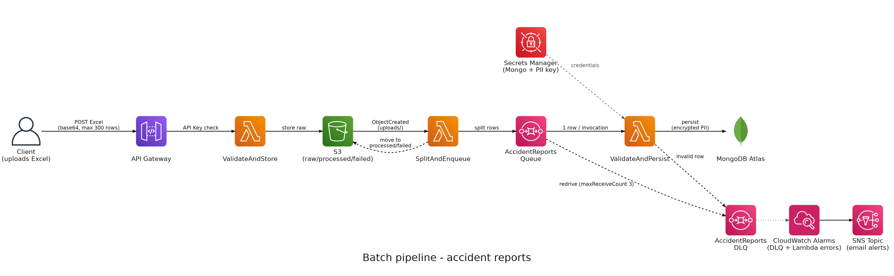
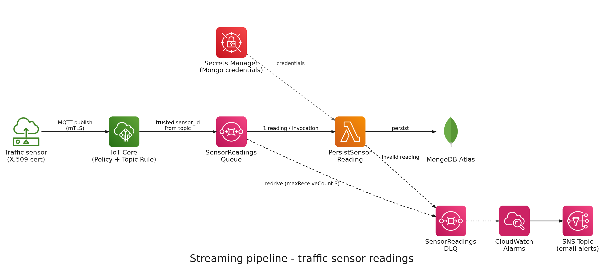

# README

- [README](#readme)
  - [Summary](#summary)
    - [Batch pipeline: accident reports](#batch-pipeline-accident-reports)
    - [Streaming pipeline: traffic sensor readings](#streaming-pipeline-traffic-sensor-readings)
    - [Observability](#observability)
    - [Repository structure](#repository-structure)
  - [Setup](#setup)
    - [Development container](#development-container)
    - [Environment variables](#environment-variables)
  - [Glossary](#glossary)
    - [AWS environment variables: `.envs/aws.env`](#aws-environment-variables-envsawsenv)
    - [Serverless Framework environment variables: `.envs/sls.env`](#serverless-framework-environment-variables-envsslsenv)

---

## Summary

`Data Engineering Course` is a traffic monitoring service for Colombian cities (Bogotá, Medellín, Cali and Barranquilla). It ingests two very different kinds of traffic data and lands both in the same MongoDB Atlas database, so transport authorities can analyze what happened on a road and what is happening on it right now.

It is built as a teaching project: every piece is deployed on AWS with Serverless Framework, and every service was chosen to stay inside the AWS free tier.

The two kinds of data are ingested by two independent pipelines, one batch and one streaming. They share the same building blocks on purpose — a queue in front of the writer, a dead-letter queue for anything that fails, validation repeated at every step — so the second one reinforces the pattern taught by the first.

### Batch pipeline: accident reports

An operator uploads an Excel file of traffic accident reports (up to 300 rows) to a REST API. The file is validated as a whole and rejected outright if any row is invalid, then stored raw in S3, split into one message per row, and written to MongoDB Atlas one row at a time. Personal data in each report (name and national ID of the person involved) is encrypted before it is stored.

### Streaming pipeline: traffic sensor readings

Fixed road sensors report average speed and vehicle count every few seconds over MQTT. Each sensor authenticates with its own X.509 certificate and can only publish to its own topic; the topic rule stamps the sensor's identity onto the message, so a sensor cannot claim to be a different one. Readings carry no personal data, so nothing is encrypted here.

### Observability

Both pipelines alarm on the same condition — anything landing in a dead-letter queue — through CloudWatch alarms that notify an SNS topic by email. An account-wide AWS Budget covers the other half of the risk in a free-tier project: spend that escapes the free tier at all.

### Repository structure

- **`backend/`**: the Lambda code (Python) and the Serverless stacks that deploy it, one stack per concern: `layers` (shared Python dependencies), `batch` and `streaming`.
- **`infrastructure/`**: the shared AWS resources both pipelines sit on, each in its own stack: `storage` (S3), `queue` (SQS + dead-letter queues), `secrets` (Secrets Manager), `iot` (IoT Core policy and topic rule) and `alerts` (alarms, SNS and the budget).
- **`docs/`**: the architecture diagrams above, generated from `docs/architecture.py`.

Each subproject has its own README with its deployment order and environment variables.

---

## Setup

### Development container

This steps are tailored to work with Visual Studio Code, but you are free to chose a different IDE and make necessary adjustments to the setup.

1. Install `ms-vscode-remote.remote-containers` extension. If you don't know how to do that follow this steps: <https://code.visualstudio.com/docs/editor/extension-gallery#_install-an-extension>
2. Open this project's folder in Visual Studio Code. The extension will detect a container configuration and will ask you if you want to reopen the project un the container. Accept.

### Environment variables

At `.envs` folder, you'll need to create env files with the variables described [here](#glossary).

---

## Glossary

### AWS environment variables: `.envs/aws.env`

- `AWS_ACCESS_KEY_ID`: _Access Key_ used to deploy Cloud Formation stack to AWS cloud. The owner of the _Access Key_ need to have sufficient IAM permissions to perform the deployment process.
- `AWS_SECRET_ACCESS_KEY`: _Secret Access Key_ that matches the _Access Key_
- `AWS_DEFAULT_REGION`: Region where you intend to deploy the stack
- `AWS_DEFAULT_OUTPUT`: Default response format for AWS CLI commands

### Serverless Framework environment variables: `.envs/sls.env`

- `SERVERLESS_ACCESS_KEY`: Serverless _Secret API Key_. Needed to deploy stack information to Serverless cloud.
